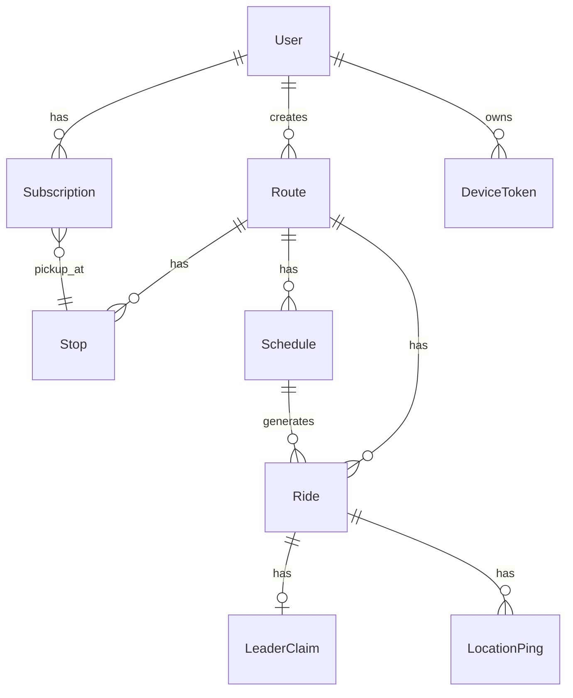
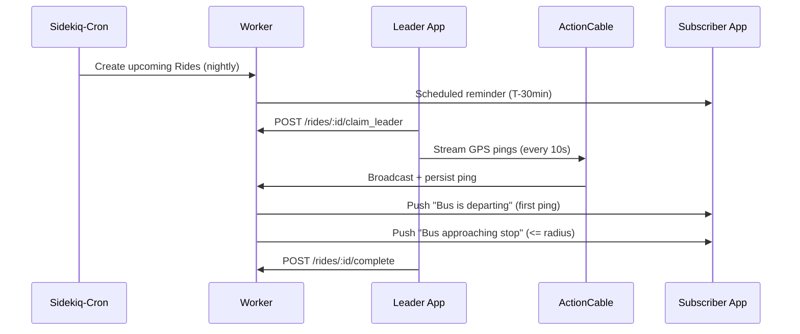

# Bike Bus App — MVP Spec

A system to plan, share, subscribe to, and follow group bike rides ("bike buses") to school.

> **First action on approval:** create `bike-bus/SPEC.md` containing this entire spec, then **stop** and wait for explicit go-ahead before writing any code.

## 1. Tech Stack (confirmed)

- **Backend:** Ruby on Rails 7.1 (API mode), PostgreSQL + PostGIS, Redis, Sidekiq
- **Realtime:** ActionCable (Redis adapter) for leader GPS streaming
- **Auth:** Devise + devise-jwt (email/password, JWT bearer tokens)
- **Push:** Firebase Cloud Messaging (FCM) for both iOS and Android
- **Maps:** Google Maps (Directions API + Maps SDK for RN)
- **Mobile:** React Native (bare workflow — needed for reliable background location)
  - `react-native-maps` (Google provider)
  - `react-native-background-geolocation` (leader-mode tracking)
  - `@react-native-firebase/messaging`
  - `@react-native-async-storage/async-storage` + Zustand
  - `axios` + ActionCable JS client

## 2. Domain Model

Single adult accounts for MVP (organizers/riders). Schema leaves room to add `ChildProfile` later.



### Tables

- **users** — devise fields, `display_name`, `phone` (optional)
- **device_tokens** — `user_id`, `fcm_token`, `platform`, `last_seen_at`
- **routes** — `creator_id`, `name`, `description`, `school_name`, `path_geojson` (LINESTRING via PostGIS), `visibility`, `active`
- **stops** — `route_id`, `position`, `name`, `lat`, `lng`, `scheduled_offset_minutes`
- **schedules** — `route_id`, `days_of_week`, `start_time`, `timezone`, `active`
- **rides** — `route_id`, `schedule_id`, `scheduled_start_at`, `status`, `started_at`, `ended_at`
- **leader_claims** — `ride_id` (unique active), `user_id`, `claimed_at`, `released_at`
- **location_pings** — `ride_id`, `user_id`, `lat`, `lng`, `heading`, `speed`, `recorded_at`
- **subscriptions** — `user_id`, `route_id`, `pickup_stop_id`, `notify_schedule`, `notify_depart`, `notify_approach`
- **notifications_log** — dedupe: `(ride_id, subscription_id, kind)` unique

## 3. Notification Flow



- **Scheduled reminder:** ~30 min before `scheduled_start_at`
- **Departure alert:** on first ping of a ride (flips status to `in_progress`)
- **Approach alert:** ping triggers Sidekiq job checking subscribers whose pickup stop is within ~400m and not yet notified
- **Stale leader:** no pings for 3 min → superseded by next claim

## 4. API Surface (JSON, JWT Bearer)

```
POST   /auth/sign_up, /auth/sign_in, /auth/sign_out
POST   /device_tokens

GET    /routes?near=lat,lng&school=...
POST   /routes
GET    /routes/:id
PATCH  /routes/:id
DELETE /routes/:id
POST   /routes/:id/stops
POST   /routes/:id/schedules

GET    /rides?route_id=&from=&to=
GET    /rides/:id
POST   /rides/:id/claim_leader
POST   /rides/:id/release_leader
POST   /rides/:id/complete

POST   /subscriptions
DELETE /subscriptions/:id
GET    /subscriptions
```

ActionCable `RideChannel` subscribed by `ride_id`; leader action `location` persists + rebroadcasts.

## 5. Mobile Client Screens (MVP)

1. Auth (sign up / sign in)
2. Home — upcoming subscribed rides, "Claim Leader" CTA when in window
3. Route Browse — nearby routes (map + list)
4. Route Detail — path, stops, schedule, subscribe + pickup-stop selector
5. Route Create/Edit — draw/snap path, ordered stops, schedule
6. Live Ride — leader marker, ETA to my stop
7. Leader Mode — background tracking, big "End Ride" button
8. Subscriptions / Settings — notification prefs, sign out

## 6. Repo Structure

```
/repos/bike-bus/
  SPEC.md
  backend/        # Rails API
  mobile/         # React Native
```

## 7. Phased Delivery

1. **Phase 1** — Backend foundations: Rails API, Postgres+PostGIS, Devise+JWT, core migrations, RSpec
2. **Phase 2** — Route & subscription API + nightly ride-materialization Sidekiq-Cron job
3. **Phase 3** — ActionCable realtime + leader claim/release/complete + stale supersession
4. **Phase 4** — FCM notifications (reminder, depart, approach) with dedupe log
5. **Phase 5** — React Native app: auth, browse, subscribe, leader mode, live ride
6. **Phase 6** — Polish, rate-limit, deploy (Fly.io/Render + TestFlight/Play Internal)

## 8. Deferred

Kid/parent profiles, web app, chat, route forking, weather/cancellation UI, analytics.

## 9. Execution Plan On Approval

1. **Create `bike-bus/SPEC.md`** with the full contents of this spec.
2. **Stop.** Report back and wait for explicit "go ahead with Phase 1" (or any adjustments) before writing any code, installing anything, or running `rails new`.
